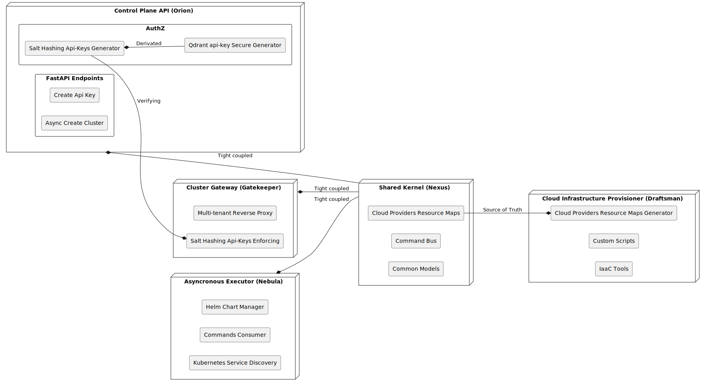
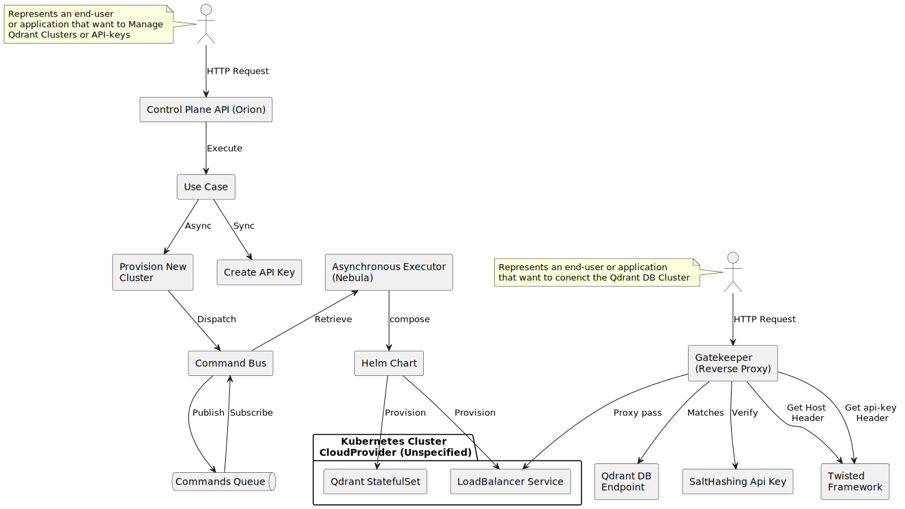

Architecture
============

There are various methodologies for designing architectures like the one
required for this technical challenge. My proposal has been to structure it
using building blocks that group, define, and delineate the different
responsibilities that I have identified as key and fundamental to achieving
a prototype under the established parameters.

These blocks, functional independently and with low coupling between them,
constitute a unified whole in their use case: a **micro-scale cloud DBSaaS**.

Designing in blocks, segregating responsibilities, and considering how
workloads will behave in real environments, is fundamental to the approach
I have adopted. Far from prematurely optimizing, this architecture stands out
for its easy extensibility and iteration.

The segregation of responsibilities will hypothetically allow different
engineering teams to evolve the building blocks or add more without
compromising or overly complicating the implementation.

The benefits of a distributed architecture like the one proposed also
involve certain compromises, such as eventual consistency, duplicate
management, and more complex deployments. Although these aspects are not
minor, for this particular case I have considered that the benefits outweigh
the drawbacks.

Building Blocks
---------------

It has been deemed necessary to fragment the proposed solution into four
clearly defined blocks by their scope of responsibility, the possible
technological stacks that support them, and their deployability and scalability
in real-world load scenarios.

Here they are briefly enumerated and described:

1 - **Orion**
    This component is the central API of the project and exposes the endpoints
    that users and stakeholders will use over time. Given its evolutionary
    nature, a versioning system based on URI resources (/v1/*) has been designed.

2 - **Nebula**
    Responsible for executing background tasks, such as provisioning *Qdrant*
    clusters. It has higher response times and eventual consistency. This
    component also interacts with Kubernetes infrastructure, provisioned for
    each cloud provider, which might eventually require it to reside in different
    cloud providers or regions.

3 - **Draftsman**
    Conceptualized but not Implemented, is operated by DevOps and SRE roles,
    it is linked to IaaC solutions such as Terraform. Its main mission is the
    provisioning of cross-region and cross-provider Kubernetes clusters,
    informing other blocks about new resource pools.

4 - **GateKeeper**
    Acts as a Reverse Proxy that exposes the Qdrant DB Clusters, ensuring security
    through api-tokens. Implemented over the Twisted framework, it allows detailing
    how a reverse-proxy works and how requests are modified by adding domain logic
    in the form of code.

The diagram visualizes the previously defined blocks and schematizes their
relationships and the underlying technical implementations. Operationally,
each block is an independent component with low coupling, and the use of
a MonoRepo gives them high cohesion.

The architecture allows for independent development life cycles and simplifies
CI/CD processes. Additionally, it reduces accidental complexity and encourages
the formation of teams around the defined boundaries.

Interactions Between Components
-------------------------------

The diagram shows that there are two main entry points: an API for cluster
management and API-keys, and the endpoint of the Qdrant DB Cluster itself
(GateKeeper), which can be replicated multiple times, always close to the DB
Clusters it serves.

With this architecture, Qdrant's endpoints do not need direct exposure to the
internet. The use of the CommandBus prevents intensive operations such as
infrastructure provisioning from overloading the API. Deployments of new
versions of Nebula are downtime-free, as messages accumulate in the broker for
later processing.

Thanks to the abstraction of the cloud provider's infrastructure with
Kubernetes, no significant specific implementations in Nebula are required to
add new cloud providers.

Specific implementation details for a provider can be addressed at the
Chart or CRD level in the case of the Kubernetes Operator.